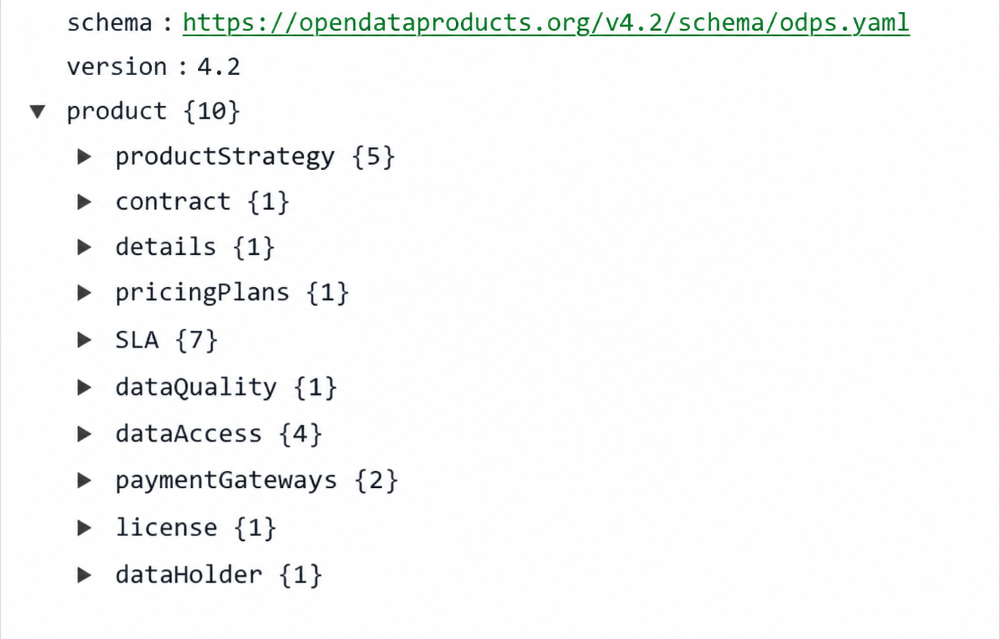

# OPEN DATA PRODUCT SPECIFICATION - The Linux Foundation

## Version 4.2

The key words “MUST”, “MUST NOT”, “REQUIRED”, “SHALL”, “SHALL NOT”, “SHOULD”, “SHOULD NOT”, “RECOMMENDED”, “NOT RECOMMENDED”, “MAY”, and “OPTIONAL” in this document are to be interpreted as described in BCP 14 ([RFC 2119](https://datatracker.ietf.org/doc/html/rfc2119) and [RFC 8174](https://datatracker.ietf.org/doc/html/rfc8174)) when, and only when, they appear in all capitals, as shown here.

The specification is shared under <a href='https://www.apache.org/licenses/LICENSE-2.0'>Apache 2.0</a> license. 
Development of the specification is under the umbrella of the Linux Foundation. 

| Topic | Link | Description |
|---|---|---|
| Version source | <a href="https://github.com/Open-Data-Product-Initiative/v4.2">Open Data Product Specification 4.2 on GitHub</a> | Official source repository for the ODPS 4.2 specification |
| ODPS YAML schema | <a href="https://opendataproducts.org/v4.2/schema/odps.yaml">YAML Schema</a> | Machine-readable schema definition in YAML format |
| ODPS JSON schema | <a href="https://opendataproducts.org/v4.2/schema/odps.json">JSON Schema</a> | Machine-readable schema definition in JSON format |
| Migration guide | [Migration guide available](#odps-4-1-4-2-migration-guide) | Notes and guidance for upgrading from ODPS 4.1 to 4.2 |
| Knowledge Base | [ODPS Knowledge Base](https://opendataproducts.org/howto/) | Practical examples, FAQs, and implementation guidance |
| Contribute | [Raise an issue in GitHub](https://github.com/Open-Data-Product-Initiative/v4.2/issues) | Submit issues or suggestions to the specification maintainers |

## Introduction

The Open Data Product Specification is a vendor-neutral, open-source machine-readable data product metadata model. It defines the objects and attributes as well as the structure of digital data products. The work is based on existing standards (schema.org), best practices and emerging concepts like Data Mesh. The reasoning is that we reuse and proudly copy instead of reinventing the wheel. More detailed information of the origin can be found from the [Open Data Product Specification homepage](http://www.opendataproducts.org). 

ODPS is complemented by the [Data Product Operating Framework](https://opendataproducts.org/framework/), an implementation-neutral operating model for directing, defining, operating, and assuring data products. ODPS provides the machine-readable contract for an individual data product, while the framework places that contract within the wider capabilities, responsibilities, evidence, and lifecycle practices needed to turn business demand into measurable value.

For implementation, the [Open Data Products SDK](https://opendataproducts.org/sdk/) provides a Python SDK, command-line interface, and MCP server for working with ODPS and the wider Open Data Products standards family. It helps developers, automation, and AI agents load, validate, explain, generate, search, traverse, and publish standards-based artifacts; it is implementation tooling built around the specifications, not part of the normative ODPS definition.

**The ODPS 4.2 specification supports referencing mechanisms** that improve modularity, reduce duplication, and ease governance. Users can reference internal components, such as Data Contract profiles, SLA, dataQuality, dataAccess, and paymentGateways, from other parts of the product definition using [JSON Reference syntax](https://json-spec.readthedocs.io/reference.html) ($ref). In addition, these components can be defined and maintained in external YAML files and included via URL-based references [Examples in the Knowledge Base](https://opendataproducts.org/howto/). This makes it possible:

* to reuse standardized SLA profiles, DQ rules, or access definitions across multiple data products, 
* helping teams manage changes consistently, reduce errors, and 
* align with enterprise-level governance practices.

Benefits of Referencing:

* DRY Principle: Avoid repetition. Define once, reference many times.
* Clarity: Consumers of your data product can easily see which quality profile is associated with a particular service tier or access plan.
* Scalability: You can support multiple audiences or markets with varying quality expectations.
* Auditability: Clearly link machine-readable checks to business commitments.

**ODPS 4.2 introduces named Data Contract profiles.** An inline profile collection requires `default`, supports additional contractual contexts such as `internal` or `restricted`, and can be maintained as an external package. Each Data Access profile may reference the applicable contract profile, allowing one contract to govern several interfaces without duplication. The ODPS 4.1 singleton Contract syntax remains valid for backward compatibility.


**ODPS 4.1 introduced the productStrategy object**, a significant extension that connects data products to business intent, objectives, and KPIs. That release made ODPS the first open specification where data products declare not just what they are but also why they exist and how success is measured.

ODPS 4.1 also added **two optional attributes that support portfolio management and governance transparency for data products.**

**The portfolioPriority attribute** allows organizations to express the relative importance of a data product within their overall data product portfolio. While lifecycle states describe maturity, portfolioPriority communicates strategic importance. This helps organizations prioritize development, allocate resources, and identify which products require stronger operational attention. Typical values include Critical, High, Medium, and Low.

**The governanceProfile attribute** indicates the governance maturity applied to the data product. Not all products require the same level of operational rigor. Some may only be structured and registered, while others must operate with automated governance controls or audit-grade traceability. GovernanceProfile provides a portable way for platforms and catalogs to understand the governance posture of a product without prescribing implementation details. Example values include structured, enforced, automated, and audit_ready.

Together these attributes allow ODPS to represent not only the structure and intent of a data product but also its importance and governance posture within a portfolio. This makes it easier for organizations to manage large collections of data products, prioritize investments, and communicate governance expectations across tools and platforms.


## HowTo - ODPS Knowledge Base

The odps‑examples repository serves as a comprehensive knowledge base for using the Open Data Product Specification (ODPS), combining clear FAQs with real-world YAML examples to guide users through practical implementation. Each FAQ entry tackles a specific task—like defining metadata, setting pricing tiers, assigning SLAs, configuring data quality rules, managing access roles, or enabling AI/agent consumption—accompanied by executable YAML snippets and full .yml files. 

The content is modular, code‑first, and designed for easy reuse, enabling teams to discover, govern, monetize, validate, and automate data products using standardized, machine-readable metadata. Users are encouraged to contribute new scenarios or enhancements via GitHub issues.

[Knowledge Base in Github](https://opendataproducts.org/howto/). 

[Udemy course - Master the Leading Data Product Specification with GPT tool](https://www.udemy.com/course/master-the-open-data-product-specification-with-gpt-tool)

## Specification aims and aspects

**Specification aims:**

* enable interoperability between organizations, data platforms,  marketplaces, and tools. 
* support and reuse related standards like data contracts
* reduce data product metadata conversions and errors between systems and organizations, 
* increase the speed of designing, testing, and implementing data products. 
* speed up tools development around data product design, development and management.
* enable creation of automated data product deployment with standard methods
* support flexible data product pricing with plans specific DQ, SLA, Payment gateways, and Access (with references)
* enable [Everything as Code](https://www.cloudbees.com/blog/what-is-everything-as-code-eac) approach for SLA and Data Quality monitoring

**Note!** In the "Open Data Product" focus is on the latter words and the prefix  'open' refers to the openness of the standard. Any kind of connotations to open data (a different thing) are not intentional, intended, or desirable.

The specification has been designed with four major aspects of the data product in mind: 

1. technical (infrastructure & access), 
2. business (product strategy & pricing & plans), 
3. legal (licensing & IPR), and 
4. ethical (privacy & mydata). 

The four aspects are described in 10 objects, which contain attributes and elements. 




If you see something missing, described inaccurately or plain wrong, or you want to comment the specification, [raise an issue in Github](https://github.com/Open-Data-Product-Initiative/v4.2/issues)

## Documentation structure

**LEFT COLUMN: Navigation**

The left column is navigation which enables fluent and easy movement around the specification. 

**MIDDLE COLUMN: Principles and components**

The middle column contains detailed information about the included components and related options. This is the theory part. 

Note! Mandatory elements and attributes are listed separately in the definition tables. This enables user to construct minimum viable specification more easily and fast. https://schema.org provided ready-made definitions are applied when ever possible instead of re-inventing the wheel. 

**RIGHT COLUMN: Examples**

The right column contains YAML formatted examples of how the specification is used. In the future other output formats are added on request basis. YAML can easily be converted to JSON if needed. 

> Example of YAML formatted snippet from the Open Data Product Specification:

```yml
dataQuality:
  declarative:
    default:
      dimensions:
        - dimension: accuracy
          displaytitle:
            en: Data Accuracy (percent)
          objective: 90
          unit: percentage
```


# Document level structure

Here's the list of attributes which can occur at the document root level. In the following description, if a field is not explicitly **REQUIRED** or described with a MUST or SHALL, it can be considered OPTIONAL. Optional attributes are listed in own table and examples are given on the right column. 

It is RECOMMENDED that the root Data Product document be named: dataproduct.json or dataproduct.yaml.

## Mandatory attributes

> Example of document level usage and structure:

```yml
schema: https://opendataproducts.org/v4.2/schema/odps.yaml
version: 4.2
product:
```

| <div style="width:150px">Element name</div>   | Type  | Options  | Description  |
|---|---|---|---|
| **schema** | URL | Valid URL. See more from [RFC 3986](https://datatracker.ietf.org/doc/html/rfc3986). | **REQUIRED** Defines the URL of Schema. Used often for validation purposes. |
| **version** | string | This is the version of ODPS, for example dev or 4.2 | **REQUIRED** Defines the ODPS version. |
| **product** | element | root element | **REQUIRED** Root element to tie all together. |
